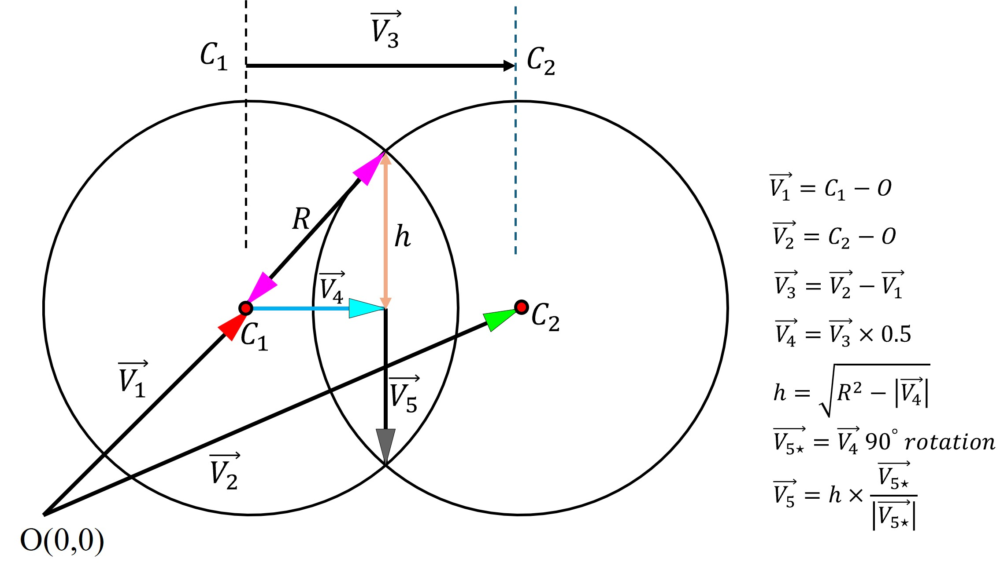
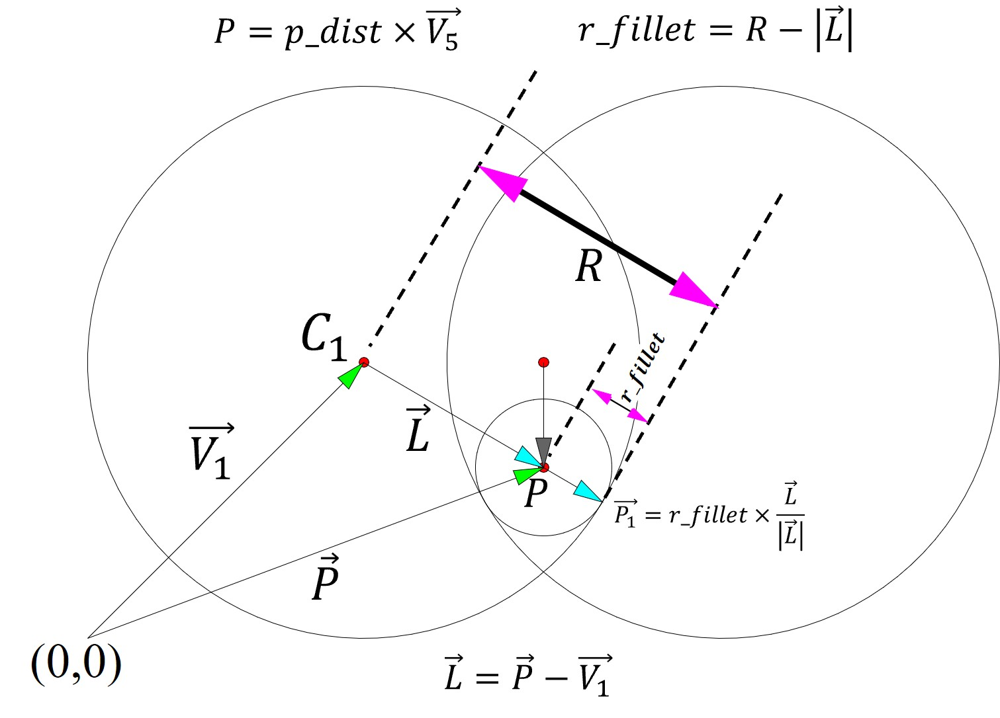
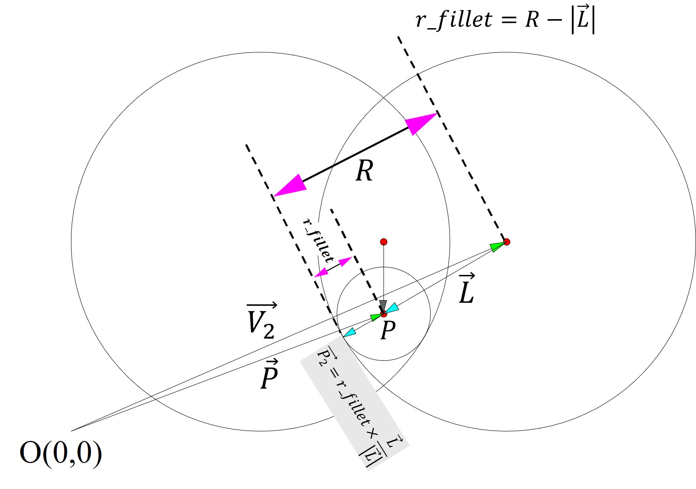
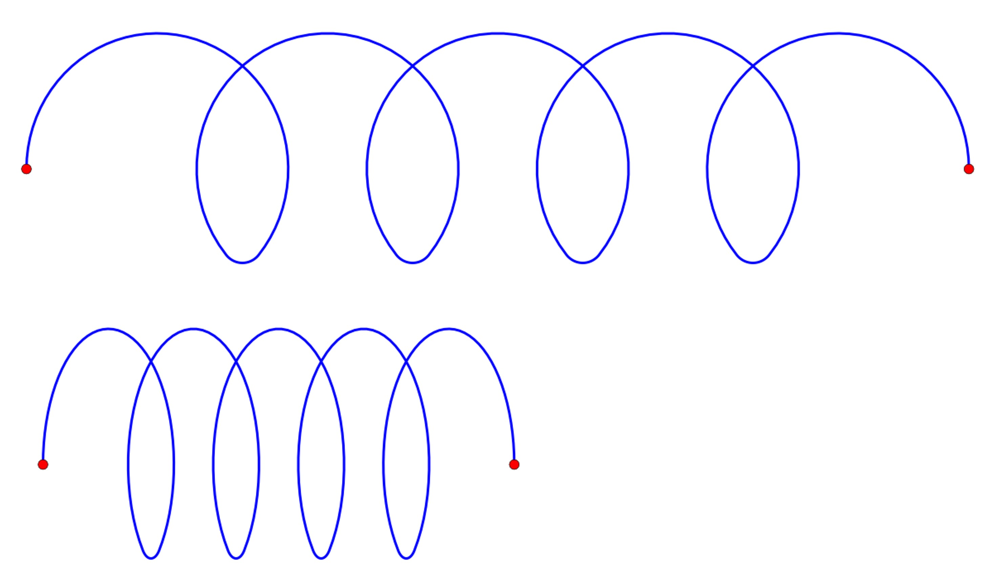
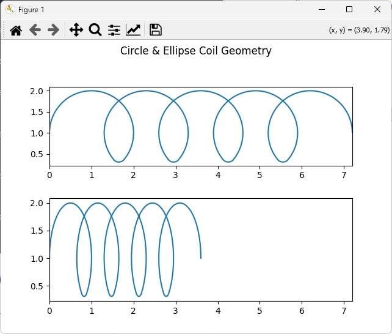

# coil-geom

**coil-geom** is a Python package for generating and visualizing **coil and inductor geometries** using clean, parametric definitions.  
It is designed for engineering, scientific visualization, and symbolic / schematic-style plotting.

- Pure geometry first (NumPy-friendly)
- Easy plotting with Matplotlib
- Suitable for electronics, physics, and CAD-style workflows

---

## Installation

```bash
pip install coil-geom
```
## Mathematical Background
<p align="center">
  
  
  
  
  
</p>
```Python
import matplotlib.pyplot as plt
import coil_geom as cg

coil = cg.CoilGeom()
xc, yc = coil.circle_coil()
xe, ye = coil.ellipse_coil()
xu, yu = coil.circle_coil(p_dist=-0.7)

fig, axs = plt.subplots(nrows=3, ncols=1, sharex=True, figsize=(8, 6))
fig.suptitle('Circle & Ellipse Coil Geometry')
axs[0].plot(xc, yc)
axs[1].plot(xe, ye)
axs[2].plot(xu, yu)

plt.show()
```
