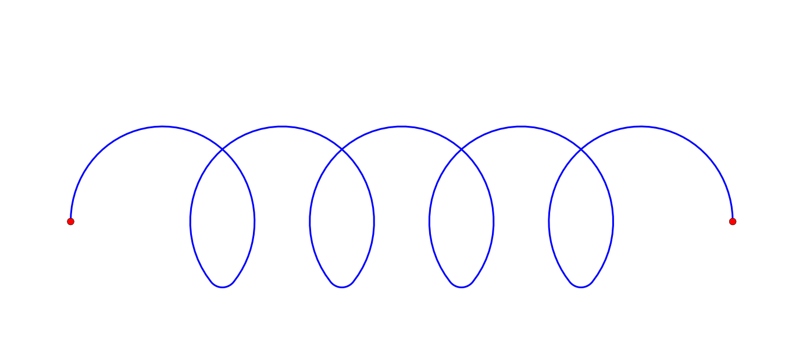
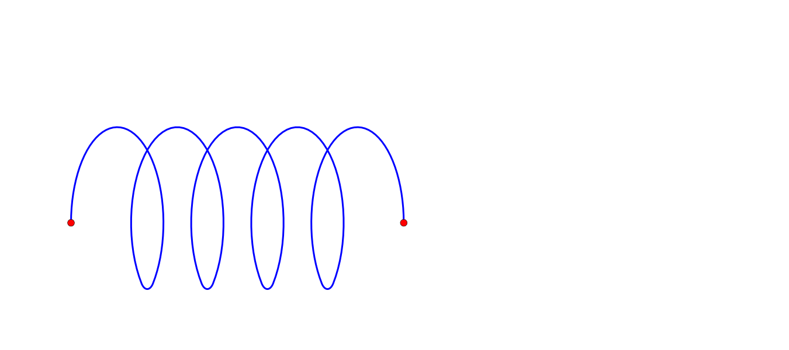

# coil-geom

**coil-geom** is a Python package for generating and visualizing **coil and inductor geometries** using clean, parametric definitions.  
It is designed for engineering, scientific visualization, and symbolic / schematic-style plotting.

- Pure geometry first (NumPy-friendly)
- Easy plotting with Matplotlib
- Suitable for electronics, physics, and CAD-style workflows

---

## Installation

```bash
pip install coil-geom
```
## Mathematical Background
<p align="center">
  
  
  
  
  
  
  
</p>
