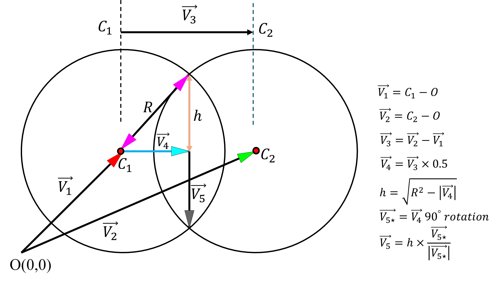
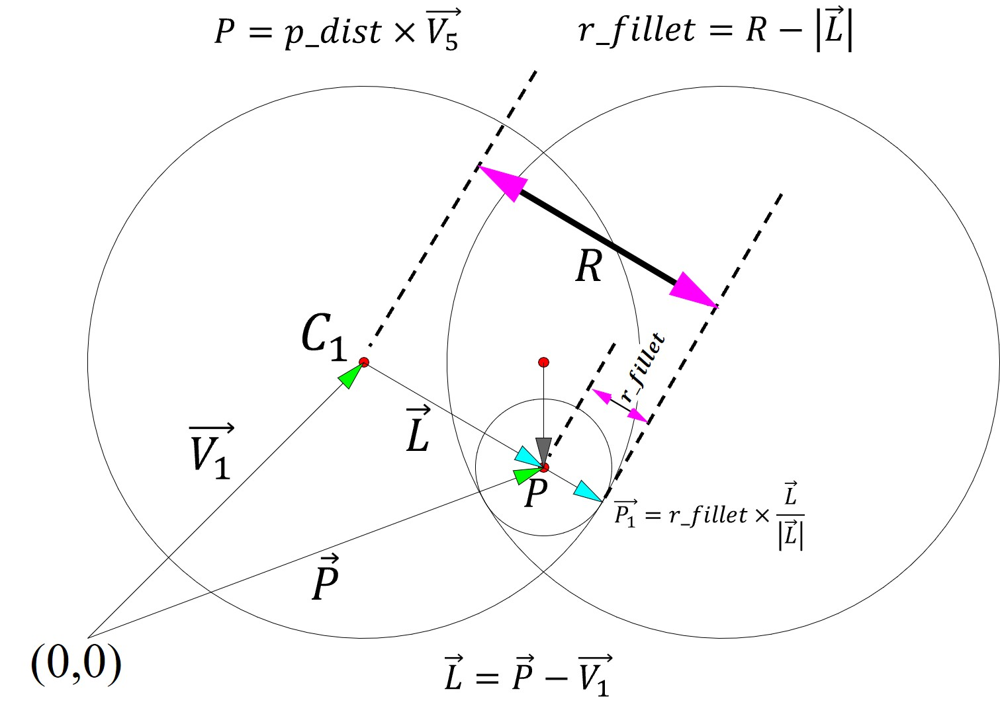
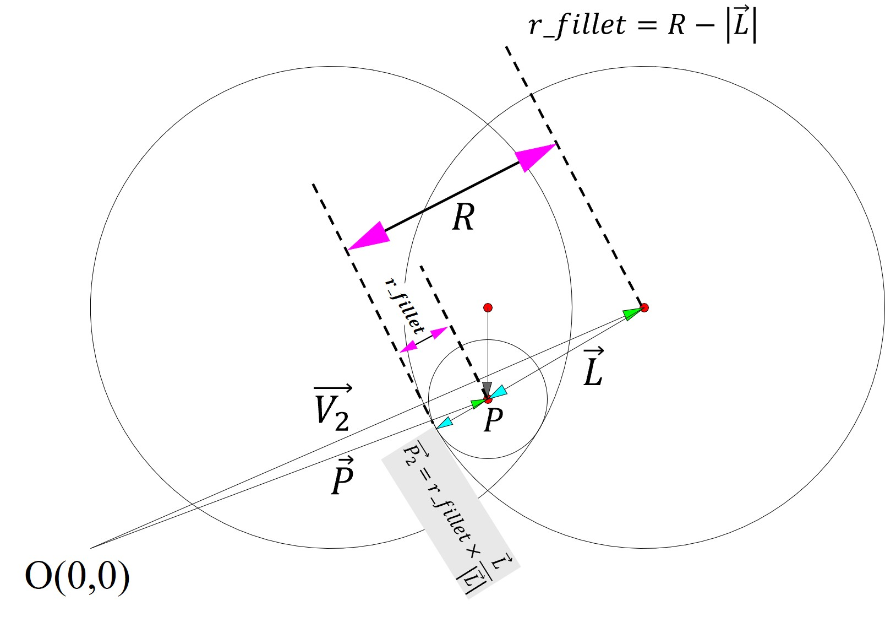
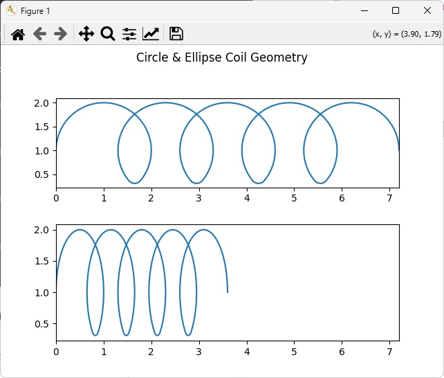
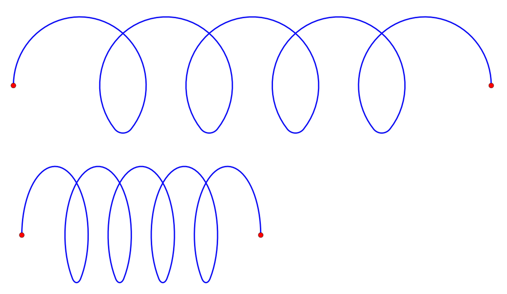
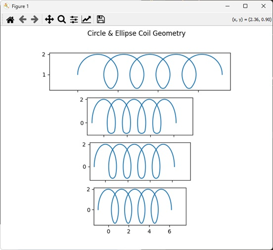
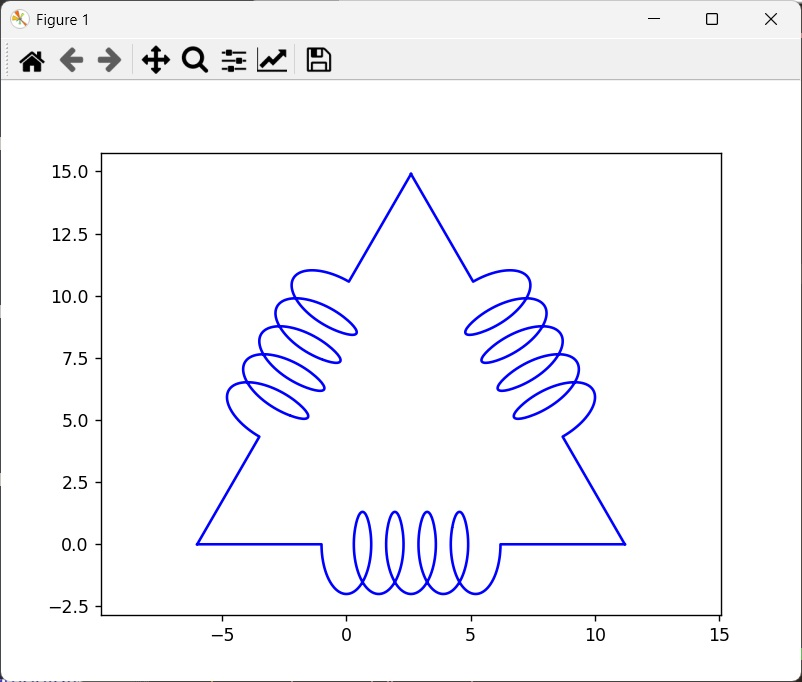
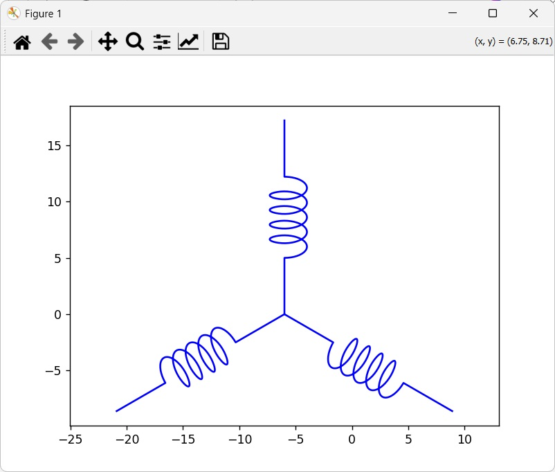

# coil-geom

**coil-geom** is a Python package for generating and visualizing **coil and inductor geometries** using clean, parametric definitions.  
It is designed for engineering, scientific visualization, and symbolic / schematic-style plotting.

- Pure geometry first (NumPy-friendly)
- Easy plotting with Matplotlib
- Suitable for electronics, physics, and CAD-style workflows

---
# Circular & Elliptic Coil Geometry with G1, G2 Continuity

## 1. Ellipse

An ellipse is a curve in the xy-plane defined by two fixed points called foci. For any point on the ellipse, the sum of its distances to the two foci is always the same constant. We place the foci on the x-axis, symmetrically about the origin, at $(-c,0)$ and $(+c,0)$. Let $P(x, y)$ be any point on the ellipse, and let $F_1$ and $F_2$ be the left and right foci respectively. We define the sum of distances as:


$$\overline{PF_1} + \overline{PF_2} = 2a$$

To see why the constant equals $2a$, consider the special case where $P$ lies on the y-axis $(x = 0)$. By symmetry, the distances to both foci are equal: $|\overline{PF_2}| = |\overline{PF_1}|$. Equation (1.1) then becomes $\overline{PF_1} + \overline{PF_2} = 2\overline{PF_1}$. At this point $P=(0,b)$, so 
$$|\overline{PF_1}| = \sqrt{(x-c)^2+y^2}$$ 

Setting this equal to $a$ gives us the important relationship:


$$c^2 + b^2 = a^2$$

Here $a$ is the semi-major axis, $b$ is the semi-minor axis, and $c$ is the distance from the center to each focus.

Now we substitute the distance formula into $\overline{PF_1} + \overline{PF_2} = 2a$:

$$\sqrt{(x-c)^2+y^2} + \sqrt{(x+c)^2+y^2} = 2a$$

Move the second radical to the right-hand side:

$$\sqrt{(x-c)^2+y^2} = 2a - \sqrt{(x+c)^2+y^2}$$

Square both sides and expand the squared terms:

$$
(x-c)^2+y^2 = 4a^2 - 4a\sqrt{(x+c)^2+y^2} + (x+c)^2+y^2
$$

$$
x^2 - 2cx + c^2 + y^2 = 4a^2 - 4a\sqrt{(x+c)^2+y^2} + x^2 + 2cx + c^2 + y^2
$$

Cancel $x^2$, $y^2$, and $c^2$ from both sides, then collect and simplify:

$$cx + a^2 = a\sqrt{(x+c)^2+y^2}$$

Square both sides again:

$$c^2x^2 + a^4 + 2a^2cx = a^2x^2 + 2a^2cx + a^2c^2 + a^2y^2$$

The $2a^2cx$ terms cancel. Rearranging:

$$-(a^2-c^2)x^2 + a^2(a^2-c^2) - a^2y^2 = 0$$

Using $b^2 = a^2 - c^2$ from equation (1.2), this becomes:

$$b^2x^2 + a^2y^2 = a^2b^2$$

Dividing both sides by $a^2b^2$ yields the standard equation of an ellipse:

$$\boxed{\frac{x^2}{a^2} + \frac{y^2}{b^2} = 1}$$

This is the standard form of an ellipse centered at the origin, with semi-major axis $a$ along the x-axis and semi-minor axis $b$ along the y-axis.

---

## 2. Circular Coil

Consider two primary circles, each of radius $R$, whose centers $C_1$ and $C_2$ are separated by a distance $d < 2R$, so that the circles partially overlap and form a lens-shaped intersection region. The goal is to inscribe a fillet circle of radius $r_{\text{fillet}}$ within this lens region such that it is internally tangent to both primary circles. This configuration is the geometric foundation of a circular coil path.

### Locating the Fillet Circle Center

Let $\vec{V_1}$ and $\vec{V_2}$ denote the position vectors of $C_1$ and $C_2$, respectively, with respect to a fixed origin $O(0,0)$. Define the displacement vector from $C_1$ to $C_2$ as:

$$\vec{V_3} = \vec{V_2} - \vec{V_1}$$

The midpoint of the segment $C_1C_2$ is then given by:

$$\vec{V_4} = \frac{1}{2}\vec{V_3}$$

The two circles intersect at two points that lie on the perpendicular bisector of $C_1C_2$. The vector $\vec{V_5}$ is defined from the endpoint of $\vec{V_4}$ along this perpendicular bisector, with magnitude equal to the half-chord height $h$:

$$h = \sqrt{R^2 - \left(\frac{|\vec{V_4}|}{2}\right)^2}$$

Vector $\vec{V_5}$ points from the endpoint of $\vec{V_4}$ toward one of the two intersection points of the primary circles.

<p align="center">
  
</p>

### Finding the Tangent (Contact) Points

A key geometric property is that the center $P$ of the inscribed fillet circle lies on the perpendicular bisector of $C_1C_2$ — that is, along the line defined by $\vec{V_5}$. We parameterize the position of $P$ as:

$$\vec{P} = p_{\text{dist}} \times \vec{V_5}$$

where $p_{\text{dist}} \in (0,1)$ is a dimensionless parameter controlling how far along $\vec{V_5}$ the fillet center $P$ is placed. A value of $p_{\text{dist}} = 0.7$ is used in practice as a reasonable default.

The fillet radius $r_{\text{fillet}}$ is then determined by the internal tangency condition: the distance from $P$ to either primary circle center must equal $R - r_{\text{fillet}}$. Equivalently,

$$r_{\text{fillet}} = R - |\vec{P} - \vec{V_1}| = R - |\vec{P} - \vec{V_2}|$$

This equality is guaranteed by the symmetry of the construction about the perpendicular bisector. Once $P$ is known, the contact point $P_1$ on circle $C_1$ is found using the displacement vector:

$$\vec{L} = \vec{P} - \vec{V_1}$$

Since $C_1$, $P$, and $P_1$ are collinear by the tangency condition, the contact point is located at:

$$\vec{P_1} = \vec{V_1} + r_{\text{fillet}} \cdot \frac{\vec{L}}{|\vec{L}|}$$

That is, $P_1$ lies on $C_1$ at a distance $r_{\text{fillet}}$ from $P$, along the line connecting $C_1$ and $P$. The contact point $P_2$ on circle $C_2$ is found analogously:

$$\vec{L} = \vec{P} - \vec{V_2}, \qquad \vec{P_2} = \vec{V_2} + r_{\text{fillet}} \cdot \frac{\vec{L}}{|\vec{L}|}$$




### Coil Direction and Segmentation

If $p_{\text{dist}} > 0$, the fillet center $P$ is placed on the side of $C_1C_2$ with a lower y-value than the primary circle centers, and the coil transitions downward. In this case the arc angles increase in the **clockwise (CW)** direction. Conversely, if $p_{\text{dist}} < 0$, the fillet center lies above the midline, the coil transitions upward, and arc angles increase **counter-clockwise (CCW)**.

The complete coil geometry is divided into three arc segments:

1. **Arc on $C_1$**: from the previous coil's contact point to $P_1$, traversed along circle $C_1$
2. **Fillet arc**: from $P_1$ to $P_2$, traversed along the fillet circle centered at $P$
3. **Arc on $C_2$**: from $P_2$ to the next coil's contact point, traversed along circle $C_2$

The $G^1$ continuity of the full path (i.e., tangent-vector continuity at each junction) is guaranteed by construction: at $P_1$ and $P_2$, the tangent to the primary circle and the tangent to the fillet circle are identical, since both are perpendicular to the shared radial line through $P_1$ (or $P_2$) and the respective centers.

---

## 2.1 Arc Angle Parameterization of the Circular Coil

Once the contact points $P_1$ and $P_2$ and the fillet center $P$ are established, the complete coil path is traced as three consecutive arcs. Each arc is parameterized by a sweep angle measured from the respective circle's center.

### Defining the Fillet Angles

The angular positions of the contact points $P_1$ and $P_2$, as seen from the fillet circle center $P$, are:

$$\theta_{\text{fillet},1} = \text{atan2}(y_{P_1}, x_{P_1}), \qquad \theta_{\text{fillet},2} = \text{atan2}(y_{P_2}, x_{P_2})$$

where $(x_{P_1}, y_{P_1})$ and $(x_{P_2}, y_{P_2})$ are the coordinates of $P_1$ and $P_2$ relative to $P$.

### Case 1: Upward Transition ($p_{\text{dist}} > 0$)

When the coil transitions downward (fillet center lies below the line $C_1C_2$), all arc angles increase in the **clockwise (CW)** direction — that is, the angle decreases numerically.



**Segment 1** — Arc on $C_1$ ($\text{Coil}_1$):

$$-\pi \leq \theta_1 \leq \theta_{\text{fillet},1}$$

This arc covers the left half of circle $C_1$, starting from the leftmost point and ending at the contact point $P_1$.

**Segment 2** — Fillet arc ($\text{Coil}_2$):

$$\theta_{\text{fillet},1} \leq \theta_2 \leq \theta_{\text{fillet},2}$$

Since the transition is downward and the fillet arc is traversed CW, this sweep passes through the bottom of the fillet circle.

**Segment 3** — Arc on $C_2$ ($\text{Coil}_3$):

The arc on the second primary circle begins at contact point $P_2$ and continues CW. Because the angle may cross the $2\pi$ boundary:

$$2\pi + \theta_{\text{fillet},2} \leq \theta_3 \leq 0 \quad \text{or} \quad 2\pi + \theta_{\text{fillet},2} \leq \theta_3 \leq \theta_{\text{fillet},1}$$

The second form applies when the coil connects into the next loop.

### Case 2: Downward Transition ($p_{\text{dist}} < 0$)

When the coil transitions upward (fillet center lies above the line $C_1C_2$), arc angles increase in the **counter-clockwise (CCW)** direction.



**Segment 1** — Arc on $C_1$ ($\text{Coil}_1$):

$$-\pi \leq \theta_1 \leq \theta_{\text{fillet},1}$$

**Segment 2** — Fillet arc ($\text{Coil}_2$):

$$\theta_{\text{fillet},1} \leq \theta_2 \leq \theta_{\text{fillet},2}$$

**Segment 3** — Arc on $C_2$ ($\text{Coil}_3$):

$$\theta_{\text{fillet},2} \leq \theta_3 \leq 2\pi \quad \text{or} \quad \theta_{\text{fillet},2} \leq \theta_3 \leq 2\pi + \theta_{\text{fillet},1}$$

The second form applies when continuing into the next coil loop.

### Summary

In both cases, the three-segment structure ensures a seamless, $G^1$-continuous coil path. Table 1 summarizes the angular bounds for each segment.

**Table 1. Angular bounds for each arc segment.**

| Segment | Arc | Upward (CW) | Downward (CCW) |
|:---:|:---:|:---:|:---:|
| 1 | Circle $C_1$ | $-\pi \leq \theta_1 \leq \theta_{\text{fillet},1}$ | $-\pi \leq \theta_1 \leq \theta_{\text{fillet},1}$ |
| 2 | Fillet circle | $\theta_{\text{fillet},1} \leq \theta_2 \leq \theta_{\text{fillet},2}$ | $\theta_{\text{fillet},1} \leq \theta_2 \leq \theta_{\text{fillet},2}$ |
| 3 | Circle $C_2$ | $2\pi+\theta_{\text{fillet},2} \leq \theta_3 \leq 0$ | $\theta_{\text{fillet},2} \leq \theta_3 \leq 2\pi$ |

---

## 3. Elliptic Coil

An idea popped up in my brain for an ellipse coil. It was squeezing just the x-coordinates of a circular coil. It looked nice, but I questioned myself: "Is this a real ellipse coil?" I was not sure, so I decided to dive into how to make an ellipse coil. The first approach was applying the transfer circle method, connecting the primary ellipses with a transfer circle located on the intersection line of two intersection points. The center of a transfer circle is on the intersection line — that value is known. The only unknown is the radius of the circle.

Two primary ellipses overlap each other. The centers of the ellipses are on the midpoint of x values, so the center of a transfer circle lies on the vertical line connecting the two intersecting points. Like the circle–transfer circle–circle method, we find the radius of the transfer circle. The simple method is to find the angle at which the distance from the center of a transfer circle to a primary ellipse is minimized. I named this **Normal Vector Optimization**.

### 3.1 Normal Vector Optimization

Find the shortest distance from $P$ to each ellipse. It will be the normal at the contacting points of an inner circle and the two ellipses. $P$ is on the vertical line connecting the two intersecting points of the given two ellipses. Instead of solving for roots, we define a cost function $f(t)$ representing the squared distance:

$$\min_{t \in [\pi,\, 2\pi]} f(t) = (a\cos t - x_c)^2 + (b\sin t - y_c)^2$$

The solution $t^*$ is found where $f'(t^*) = 0$:

$$\begin{aligned}
f'(t) &= 2(a\cos t - x_c)(-a\sin t) + 2(b\sin t - y_c)(b\cos t) \\
      &= 2\bigl[(a\cos t - x_c),\ (b\sin t - y_c)\bigr] \cdot (-a\sin t,\ b\cos t)
\end{aligned}$$

This is the form of a vector dot product. Let $E(t) - P$ be the radius vector from the center of the circle to a point on a primary ellipse, denoted $\vec{PT}$:

$$\vec{PT} = E(t) - P = (a\cos t - x_c,\; b\sin t - y_c)$$

$$\mathbf{E'(t)} = \begin{pmatrix} a\cos t \\ b\sin t \end{pmatrix}' = \begin{pmatrix} -a\sin t \\ b\cos t \end{pmatrix}$$

$\mathbf{E'(t)}$ is a tangential vector on a point of a primary ellipse. The derivative of $f(t)$ is a dot product of two vectors, which equals zero when the vectors are perpendicular. Therefore, the point of shortest distance is the point where the radius of the transfer circle is perpendicular to the primary ellipse. The distance function from the center of the circle $P$ to a point on an ellipse is $f(t) = |E(t) - P|^2$. At $E(t^*)$ where the distance is minimized, the derivative $f'(t)$ becomes zero:

$$f'(t) = 2\,\vec{PT} \cdot \mathbf{E'(t)} = 0$$

**$G^1$ Continuity Proof.** $G^1$ continuity holds when two curves share a point and the directions of their tangent vectors are identical. We know the tangent vector of a primary ellipse and the radius vector are perpendicular. Likewise, from the property of circles, the tangent vector on a point of a circle is perpendicular to the radius vector. Their tangent slopes are therefore identical:

$$\left.\frac{dy}{dx}\right|_{\text{ellipse}} = \left.\frac{dy}{dx}\right|_{\text{circle}} = -\frac{a\sin t^*}{b\cos t^*}$$

As a result, a primary ellipse and a transfer circle share $G^0$ continuity (equal position) and $G^1$ continuity (equal tangent direction) at the transition points. The smoothness of the elliptical coil is guaranteed at these transition points. By constraining the search range to $[\pi, 2\pi]$, convergence to the desired physical contact point is guaranteed without ambiguity.

```python
from scipy.optimize import minimize_scalar

# Distance squared from P to ellipse E(t) = (a*cos t, b*sin t)
def dist_sq(t):
    tx, ty = self.a * np.cos(t), self.b * np.sin(t)
    return (tx - self.x_mid)**2 + (ty - self.p_dist)**2

# Search for the closest point on the lower-left side of the ellipse
res = minimize_scalar(dist_sq, bounds=(np.pi, 2 * np.pi), method='bounded')
self.t_star = res.x
```

Normal Vector Optimization (NVO) is the superior method for practical engineering and software implementation. It bypasses the "algebraic swamp" of the 4th-degree polynomial while providing a more intuitive control variable ($y_c$) for designers. It mathematically guarantees $G^1$ continuity, making it ideal for path planning in coil winding or aerodynamic modeling.


However, something felt missing. It is because of the curvature difference between an ellipse and a transfer circle. The curvature of the primary ellipse varies along the curve, whereas the curvature of the transfer circle is constant and much larger than that of the ellipse ($\kappa_{\text{circle}} = 4.91$, $\kappa_{\text{ellipse}} = 0.687$). At this point $G^2$ continuity breaks, and human eyes perceive the discontinuity. This phenomenon led to a more robust method.

---

### 3.2 Transition Ellipse with Curvature and Shape Similarity

The goal of this section is to draw a transfer ellipse connecting two primary ellipses instead of a transfer circle. The known values are the x-coordinate of the transfer ellipse passing through the two contact points $(P_1, P_2)$. The transfer ellipse is symmetric at $x = x_s$ and the endpoint is $(x_s, y_s)$. The unknowns are the major axis, minor axis, and the y-coordinate of the center of the transfer ellipse.

$$\frac{(x - x_c)^2}{a^2} + \frac{(y - y_c)^2}{b^2} = 1 \qquad \text{(Primary Ellipse)}$$

$$\frac{(x - x_s)^2}{a_s^2} + \frac{[y - (y_s - b_s)]^2}{b_s^2} = 1 \qquad \text{(Transfer Ellipse)}$$

**Methodology**

We use the position value and derivative of $x$.

1. Find $m = dy/dx$ from the primary ellipse and use it in step 2.
2. Take the derivative of $x$ from the transfer ellipse and rewrite with respect to $1/a_s^2$.
3. Insert the result of step 2 into the equation of the transfer ellipse and rewrite with respect to $b_s^2$.

Take the derivative of the primary ellipse:

$$\frac{x - x_c}{a^2} + \frac{y - y_c}{b^2}\frac{dy}{dx} = 0$$

$$m = -\frac{b^2}{a^2}\frac{x_t - x_c}{y_t - y_c}, \quad \text{where } x_t = a\cos(t^*),\; y_t = b\sin(t^*)$$

Next, use the equation of the transfer ellipse:

$$\frac{(x-x_s)^2}{a_s^2} + \frac{[y-(y_s-b_s)]^2}{b_s^2} = 1$$

Expanding the second term on the left side and simplifying step by step:

$$\frac{(x-x_s)^2}{a_s^2} + \frac{(y-y_s)^2}{b_s^2} + \frac{2(y-y_s)}{b_s} = 0$$

Taking the derivative of both sides and letting $dy/dx = m$:

$$\frac{x-x_s}{a_s^2} + \frac{(y-y_s)\,m}{b_s^2} + \frac{m}{b_s} = 0$$

Rewriting with respect to $1/a_s^2$:

$$\frac{1}{a_s^2} = -\frac{m}{x-x_s}\left[\frac{y-y_s}{b_s^2} + \frac{1}{b_s}\right]$$

Inserting into the transfer ellipse equation and multiplying through by $b_s^2$:

$$-m(x-x_s)(y-y_s) - m(x-x_s)b_s + (y-y_s)^2 + 2(y-y_s)b_s = 0$$

$$\bigl[2(y-y_s) - m(x-x_s)\bigr]b_s = m(x-x_s)(y-y_s) - (y-y_s)^2$$

$$b_s = \frac{m(x-x_s)(y-y_s) - (y-y_s)^2}{2(y-y_s) - m(x-x_s)}$$

At $x = x_t$, $y = y_t$, letting $\Delta x = x_t - x_s$ and $\Delta y = y_t - y_s$:

$$\boxed{b_s = \frac{m\,\Delta x\,\Delta y - \Delta y^2}{2\,\Delta y - m\,\Delta x}}$$

From the equation of the transfer ellipse with $x = x_t$, $y = y_t$:

$$\frac{\Delta x^2}{a_s^2} + \frac{\Delta y^2}{b_s^2} + \frac{2\,\Delta y}{b_s} = 0$$

$$\boxed{a_s = \sqrt{\frac{-\Delta x^2}{(\Delta y/b_s)^2 + 2(\Delta y/b_s)}}}$$

**The Uniqueness of Solution**

For a transition ellipse to be physically valid and uniquely determined under the Vertex Model (where the peak is fixed at $(x_s, y_s)$ and it must pass through $(x_t, y_t)$ with slope $m$), the following conditions must be satisfied.

**Condition 1 — Non-Singularity (The Parabolic Limit)**

The denominator of $b_s$ must not be zero:

$$2\frac{\Delta y}{\Delta x} - m \neq 0 \implies m \neq 2\frac{\Delta y}{\Delta x} = 2\frac{y_t - y_s}{x_t - x_s}$$

where $m$ is the slope at $(x_t, y_t)$ on the primary ellipse, and $\Delta y/\Delta x$ is the slope of the secant line from the contact point to the vertex of the transfer ellipse. If $m = 2\,\Delta y/\Delta x$, the curve degenerates into a parabola ($b_s \to \infty$).

**Condition 2 — Physical Reality**

For the curve to be a real ellipse (not a hyperbola or imaginary shape), $a_s^2 > 0$. Since the numerator $-\Delta x^2$ is always negative, the denominator must also be negative:

$$\left(\frac{\Delta y}{b_s}\right)^2 + 2\frac{\Delta y}{b_s} < 0$$

Solving this inequality for $u = \Delta y / b_s$:

$$-2 < \frac{\Delta y}{b_s} < 0$$

**The Meaning of $\Delta y < 0$: "Contact Point Below Vertex"**

In the Top Transition model, $(x_s, y_s)$ is the peak (highest point) of the transition ellipse. Since the contact point must be lower than the peak for the curve to "bridge" downwards, $y_t < y_s$ always holds, making $\Delta y$ negative.

**Why $\Delta y / b_s$ Must Fall Between $-2$ and $0$**

The ratio $\Delta y / b_s$ determines where the contact point lies relative to the ellipse's vertical span:

- $\Delta y / b_s = 0$: Contact point is at the same height as the vertex. No curve can be formed.
- $\Delta y / b_s = -1$: Contact point is exactly at the level of the ellipse's center ($\Delta y = -b_s$).
- $\Delta y / b_s = -2$: Contact point is at the very bottom vertex of the transition ellipse ($\Delta y = -2b_s$).

The condition $-2 < \Delta y / b_s < 0$ is a **Physical Reality** constraint: the contact point must be below the peak but above the bottom of the ellipse.

**For a Bottom Transition**

If the design is flipped to create a transition at the bottom of the coil, the vertex $(x_s, y_s)$ becomes the lowest point (trough) and the contact point sits above it. The sign of $\Delta y$ becomes positive, and the existence range shifts to $0 < \Delta y / b_s < 2$.

**Table 2. Existence conditions by transition type.**

| Transition Type | Vertex Role | Sign of $\Delta y$ | Existence Condition |
|:---:|:---:|:---:|:---:|
| Top | Peak (Highest) | Negative ($-$) | $-2 < \Delta y/b_s < 0$ |
| Bottom | Trough (Lowest) | Positive ($+$) | $0 < \Delta y/b_s < 2$ |

---

### 3.3 Optimization: Curvature & Shape Similarity

The determination of the peak height $y_s$ is not a simple algebraic exercise but a targeted optimization process. While the Vertex Model ensures $G^1$ (tangent) continuity for any given $y_s$, we seek the specific value that achieves a higher-order design objective — $G^2$ (curvature) continuity or shape preservation. The primary design variable is the vertical offset $\delta$, which adjusts the peak relative to a reference height:

$$y_s = (y_{c_{\text{center}}} + r_{\text{fillet}}) + \delta$$

The optimization is driven by a **Similarity Function** $f(\delta)$ based on the desired mode.

**Curvature Similarity ($G^2$ Continuity).** We aim to match the radius of curvature of the main ellipse $\rho_m$ and the bridge ellipse $\rho_b$ at the contact point $P_t$:

$$\rho_m = \frac{(a^2\sin^2 t^* + b^2\cos^2 t^*)^{3/2}}{ab}$$

The vertex $(x_s, y_s)$ is not the center of the transition ellipse. Therefore, we need to find the relative angle $\phi_t$ at the contact point $(x_t, y_t)$ relative to the center of the transition ellipse. Setting $\Delta X = x_t - x_s$ and $\Delta Y = y_t - (y_s - b_s)$:

$$\cos\phi_t = \frac{\Delta X}{a_s}, \qquad \sin\phi_t = \frac{\Delta Y}{b_s}$$

To retrieve the true parametric phase $\phi_t$, we map the elliptical coordinates onto a unit circle:

$$\phi_t = \text{atan2}\!\left(\frac{\Delta Y}{b_s},\, \frac{\Delta X}{a_s}\right)$$

$$\rho_b = \frac{(a_s^2\sin^2\phi_t + b_s^2\cos^2\phi_t)^{3/2}}{a_s b_s}$$

$$f(\delta) = \frac{\min(\rho_m, \rho_b)}{\max(\rho_m, \rho_b)} \times 100 - \text{Target}$$

**Shape Similarity (Eccentricity).** We aim to match the aspect ratio (eccentricity) of the bridge to that of the main coil:

$$f(\delta) = \frac{\min(b/a,\; b_s/a_s)}{\max(b/a,\; b_s/a_s)} \times 100 - \text{Target}$$

---

**Algorithm 1 — Ellipse Coil Geometry: Optimization of Vertex Height ($y_s$)**

```
PROCEDURE optimal_transition_ellipse(mode):
  // Find the contact points from the given center of inscribed circle
  x_c, y_c  ← center of inscribed circle
  a, b      ← major & minor axis of primary ellipse

  IF p_dist >= 0:
      θ ← [π, 2π]
  ELSE:
      θ ← [0, π]

  FUNCTION dist_sq(t):
      t_x ← x_c + a·cos(t)
      t_y ← y_c + b·sin(t)
      RETURN (t_x - x_c)² + (t_y - y_c)²

  t*, r_fillet ← minimize_scalar(dist_sq, θ)

  // Find the optimal peak height y_s satisfying G² continuity or Shape Similarity
  x_t ← a·cos(t*)
  y_t ← b·cos(t*)
  m   ← -(b²·x_t) / (a²·y_t)
  ρ_m ← (a²·sin²(t*) + b²·cos²(t*))^1.5 / (a·b)

  // Find optimum initial δ₀
  y_base ← b·sin(arccos(x_mid / a))
  δ      ← |y_t - y_base| × 0.5

  // VHCS: Vertex Height Curvature Similarity
  // VHSS: Vertex Height Shape Similarity
  IF mode is Curvature Similarity:
      δ_opt, a_s, b_s ← fsolve(VHCS, δ, tolerance=1e-6)
  ELSE:
      δ_opt, a_s, b_s ← fsolve(VHSS, δ, tolerance=1e-6)

  y_s,final ← y_c + r_fillet + δ_opt
  a_s,final ← a_s
  b_s,final ← b_s
```

---

**Algorithm 2 — Optimization of Vertex Height With Curvature Similarity**

```
PROCEDURE Vertex_Height_Curvature_Similarity(δ):
  y_s    ← y_c + r_fillet + δ
  Δx     ← x_t - x_s
  Δy     ← y_t - y_s
  Δsecant ← Δy / Δx

  // Condition 1: Non-singularity (Check if it's not a parabola)
  IF m >= 2·Δsecant:
      ERROR: Geometry exceeds elliptic limit (Parabolic/Hyperbolic)
      RETURN 0

  // Apply Vertex Model Exact Solution
  b_s ← (m·Δx·Δy - Δy²) / (2·Δy - m·Δx)
  a_s² ← -Δx² / [(Δy/b_s)² + 2(Δy/b_s)]

  IF b_s <= 0 AND a_s² <= 0:
      RETURN 0

  // Calculate curvature of a_s, b_s, y_s
  φ_t ← atan2((ΔY + b_s)/b_s, ΔX/a_s)
  ρ_b ← (a_s²·sin²(φ_t) + b_s²·cos²(φ_t))^1.5 / (a_s·b_s)
  f_b ← min(ρ_m, ρ_b) / max(ρ_m, ρ_b) × 100 − Target
  RETURN f_b
```

---

**Algorithm 3 — Optimization of Vertex Height With Shape Similarity**

```
PROCEDURE Vertex_Height_Shape_Similarity(δ):
  y_s    ← y_c + r_fillet + δ
  Δx     ← x_t - x_s
  Δy     ← y_t - y_s
  Δsecant ← Δy / Δx

  // Condition 1: Non-singularity (Check if it's not a parabola)
  IF m >= 2·Δsecant:
      ERROR: Geometry exceeds elliptic limit (Parabolic/Hyperbolic)
      RETURN 0

  // Apply Vertex Model Exact Solution
  b_s ← (m·Δx·Δy - Δy²) / (2·Δy - m·Δx)
  a_s² ← (-Δx²) / [(Δy/b_s)² + 2(Δy/b_s)]

  IF b_s <= 0 AND a_s² <= 0:
      RETURN 0

  // Calculate eccentricity of a, b, a_s, b_s
  f_b ← min(b/a, b_s/a_s) / max(b/a, b_s/a_s) × 100 − Target
  RETURN f_b
```


## Installation

```bash
pip install coil-geom
```

```Python
import matplotlib.pyplot as plt
import coil_geom as cg

cc = cg.CircleCoil(ncoil=5)
ce = cg.EllipseCoil(ncoil=5)
ces = cg.EllipseCoilShape(ncoil=5)
cec = cg.EllipseCoilCurvature(ncoil=5)

x1, y1 = cc.get_geom()
x2, y2 = ce.get_geom()
x3, y3 = ces.get_geom()
x4, y4 = cec.get_geom()

fig, axs = plt.subplots(nrows=4, ncols=1, figsize=(8, 6))
fig.suptitle('Circle & Ellipse Coil Geometry')
axs[0].plot(x1, y1)
axs[0].set_aspect('equal')
axs[1].plot(x2, y2)
axs[1].set_aspect('equal')
axs[2].plot(x3, y3)
axs[2].set_aspect('equal')
axs[3].plot(x4, y4)
axs[3].set_aspect('equal')
plt.show()
```

```Python
def three_delta(coil, lead_l, lead_r):

    xs, ys = [], []
    c1 = coil.create_geom(False, lead_l, lead_r)
    xs.append(c1.x)
    ys.append(c1.y)
    
    c2 = c1.flipud().rotate(60, axis=0)
    xs.append(c2.x)
    ys.append(c2.y)
    
    c3 = c1.flipud().rotate(-60, axis=2)
    xs.append(c3.x)
    ys.append(c3.y)
        
    return xs, ys
```


```Python
def three_y(coil, lead_l, lead_r):

    xs, ys = [], []
    c = coil.create_geom(False, lead_l, lead_r)
    c1 = c.rotate(90, axis=0)
    xs.append(c1.x)
    ys.append(c1.y)
    
    c2 = c1.rotate(120, axis=0)
    xs.append(c2.x)
    ys.append(c2.y)
    
    c3 = c2.rotate(120, axis=0)
    xs.append(c3.x)
    ys.append(c3.y)        
    return xs, ys
```

